# M5radio RDA5807M
M5DialによるDSPラジオチップRDA5807Mの制御

## 概要  

DSPラジオチップRDA5807Mを搭載したSeeedStudio社 Grove-I2C-FM-Receiver-v1-1をM5Stack社 M5Dialで制御するプログラム  
現在使える機能は、選局と音量調整のみ  

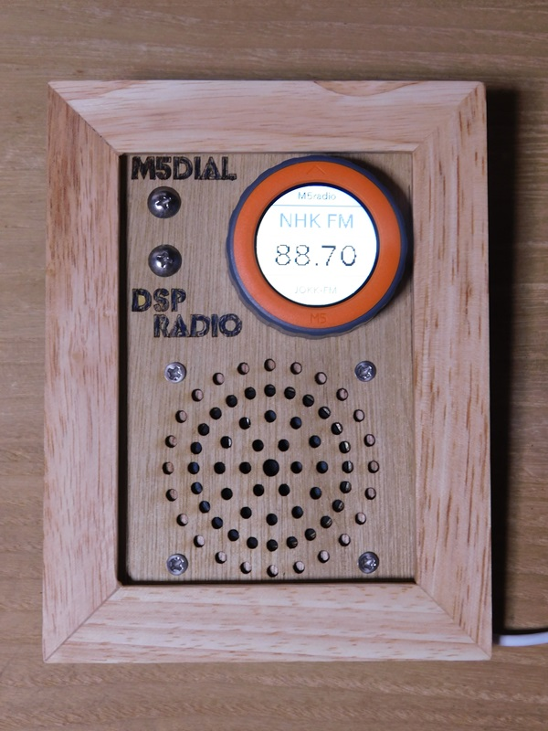

## ハードウェア

* M5Stack社 [M5Dial](https://docs.m5stack.com/ja/core/M5Dial)
* SeeedStudio社 [Grove-I2C-FM-Receiver-v1-1](https://wiki.seeedstudio.com/Grove-I2C_FM_Receiver_v1.1/)

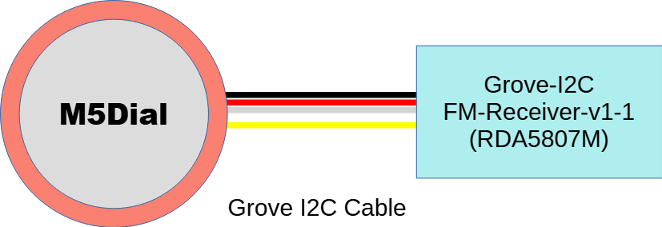{width=50%}
システム構成図  

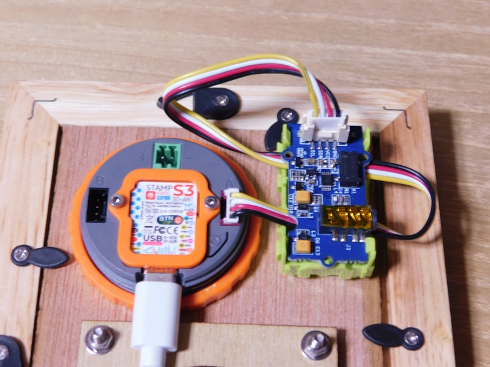
パーツレイアウト

## 開発環境

Arduino-IDE  
<https://www.arduino.cc/en/software>

## 使用ライブラリ

* M5Unified: <https://github.com/m5stack/M5Unified>
* M5Dial: <https://github.com/m5stack/M5Dial>
* RDA5807 Arduino Library: <https://github.com/pu2clr/RDA5807>

## 使用方法

* Ａボタン  選局画面、音量画面の切替え  
* ダイヤル  選局または音量の設定  

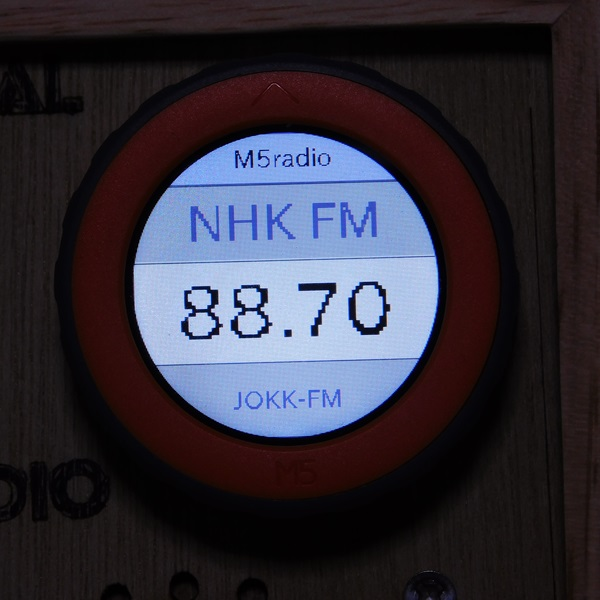
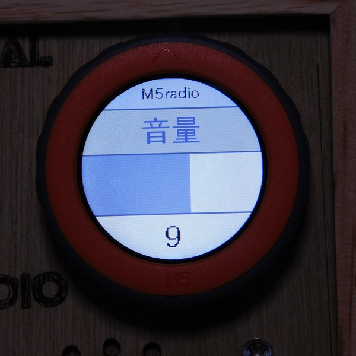  


## 解説

ラジオモジュールの制御は、Ricardo Lima Caratti 氏が公開しているRDA5807用ライブラリを使用した。  
非常に優秀なライブラリで、簡単な初期設定だけで、すぐに使うことができた。  
制御に使用したM5Dialの表示部の液晶は円形で、プログラムからみると240x240dotsの正方形の描画領域があり、その中の直径240dotsのエリアが円形として表示される。  
表示したいパーツを円形の表示エリアに収まるように配置する必要があり、そのレイアウトに苦労した。

## GUIについて

前述のように、M5Dialは特殊な画面構成なので、文字の色・大きさとその配置場所を試行錯誤しながら調整を繰り返していた。その中で、無駄な機能の重複などが複数あり、コードの共通部分を整理をしてクラスとしてまとめていったら、GUIコンポーネント風のものが出来上がった。  

* TitleBar
* Button
* ProgressBar
* TextField
* TextLabel
* Theme

文字を表示する座標位置、フォントの種類とサイズなどを最初に定義しておけば、再描画時に、同じ位置に同じ内容を表示するだけのものである。  
単純なものであるが、少し開発が楽になった。

## テーマ

前述のGUIコンポーネントもどきは、オブジェクトの配色を個別に設定できる。しかし、配色がバラバラでは統一感に欠ける。
そこで、Java Swing の設計思想を見習い、カラーテーマとして、白、黒、プライマリー 3色、セカンダリー 3色の合計8色の色配列を定義し、それを読み込んでコンポーネントに反映させる機能を追加した。  

使い方は、以下の通りである。

1. ヘッダファイルPalette.h 内に、以下のような8色の色配列を定義する。

``` cpp
uint8_t Palette_startrek[8][3] = {
  { 104, 104, 104 },  // white
  { 255, 160,   0 },  // black
  { 153, 153, 204 },  // primary1 (0,0,0)
  { 156, 156, 255 },  // primary2
  { 102, 160, 255 },  // primary3
  { 102,   0, 204 },  // secondary1
  { 255, 204,   0 },  // secondary2
  {  66,  33,  66 }   // secondary3 (0,0,0)
};
```

2. テーマクラスのコンストラクタを生成する。

``` cpp
Theme theme;
```

3. テーマオブジェクトを初期化し、8色の色配列を読み込む。

``` cpp
theme.init();
theme.setColorSet(Palette_startrek);
```

4. 使用するコンポーネントに、生成したテーマオブジェクトを引数として渡し、コンストラクタを生成する。

``` cpp
titlebar = new TitleBar(theme, "TitleBar", 1, 0, 0, 240, 40);
textfield = new TextField(theme, "field1", 2, 0, 60, 240, 60);
btnA = new Button(theme, "buttonA", 2, 0, 180, 240, 60);
```  

以下は、テーマを入替えたテスト用アプリの実行画面

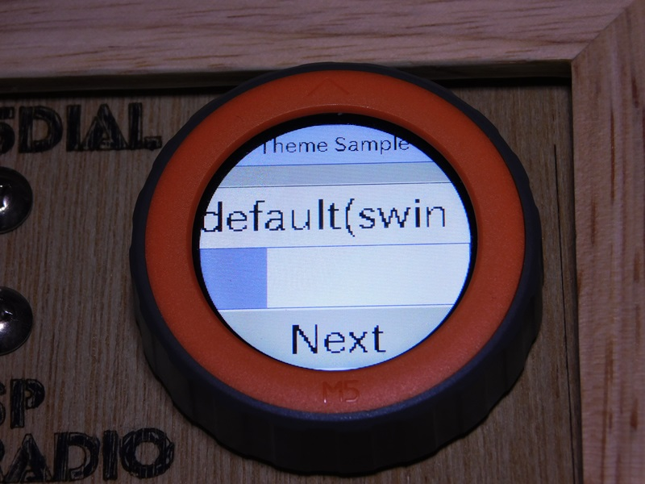
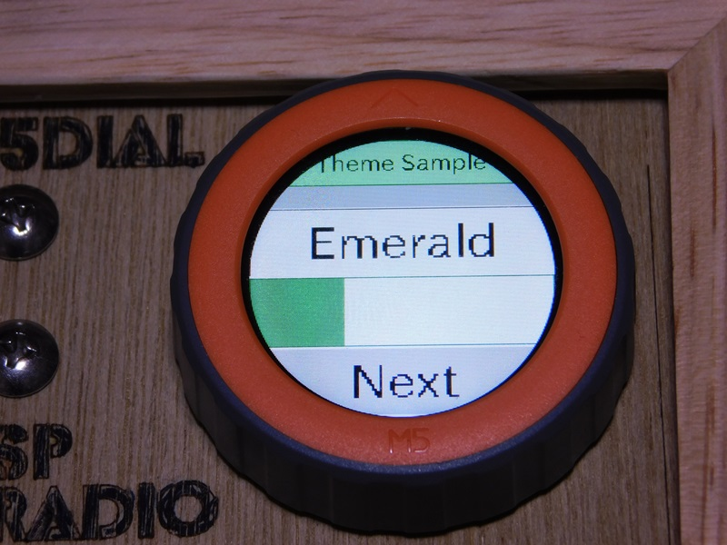
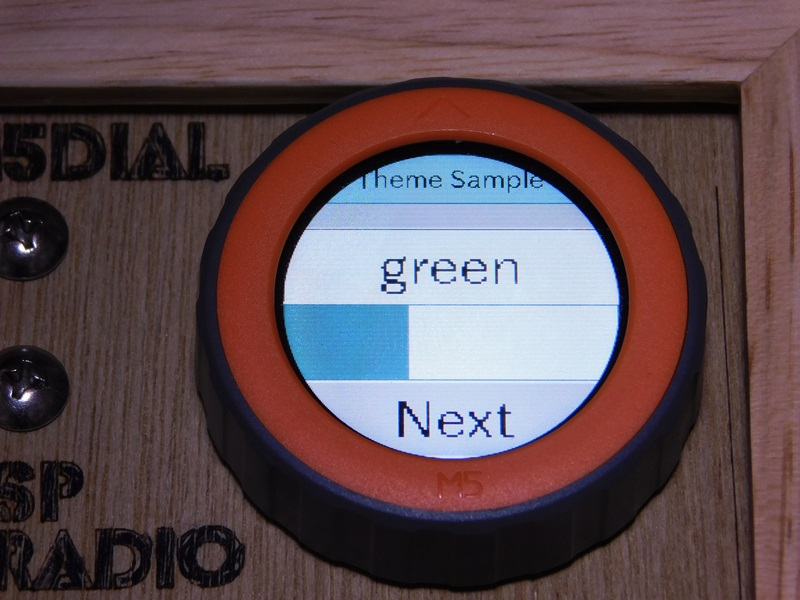  

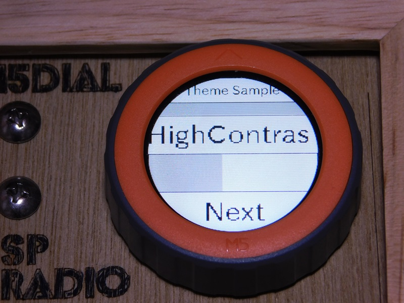
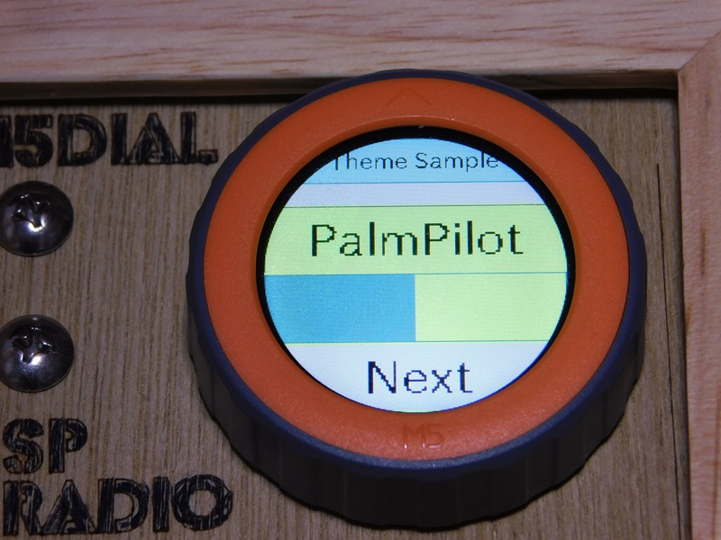
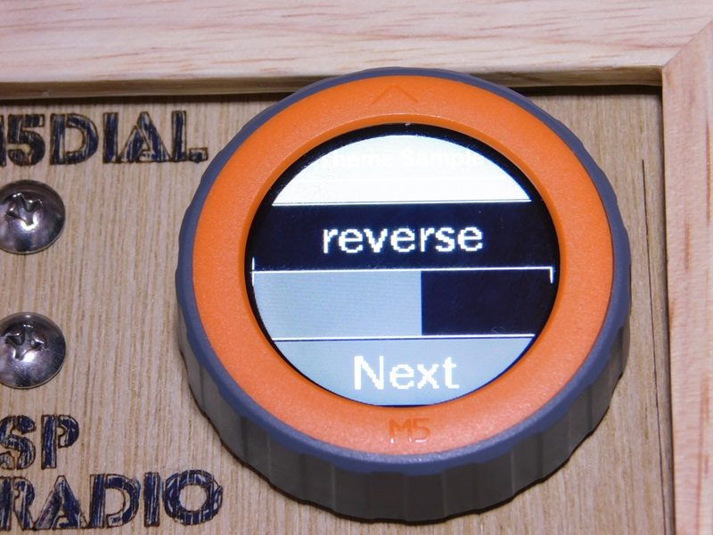  

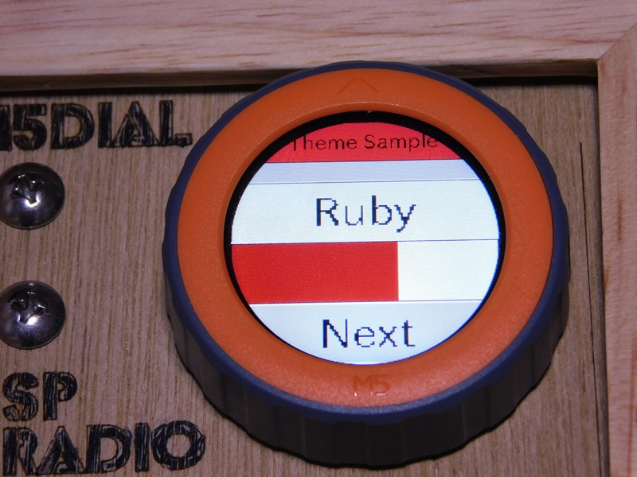
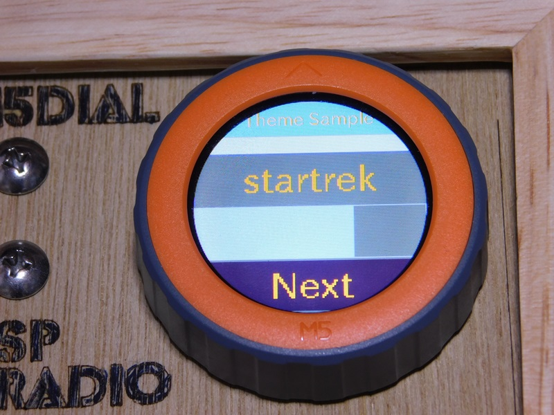
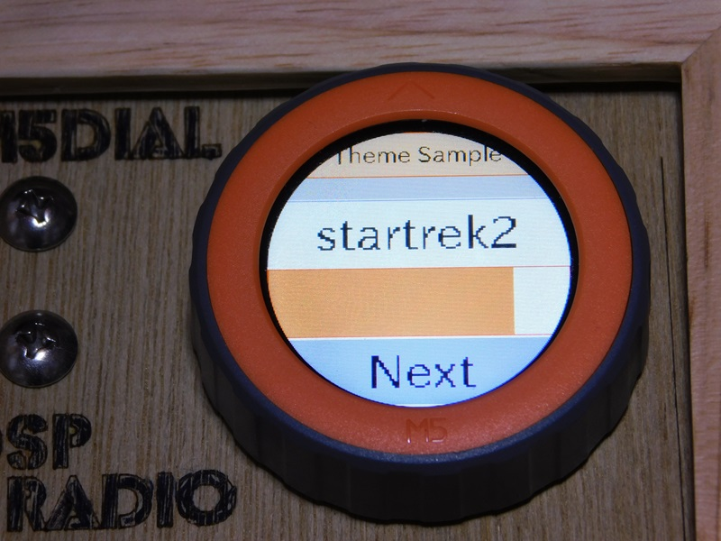


## ライセンス

お粗末なコードではあるが、[Poul-Henning Kamp](https://people.freebsd.org/%7Ephk/) 氏が提唱しているBEER-WAREライセンスを踏襲し配布する。  

### "THE BEER-WARE LICENSE" (Revision 42)

<akio@triring.net> wrote this file. As long as you retain this notice you
can do whatever you want with this stuff. If we meet some day, and you think this stuff is worth it, you can buy me a beer in return.
Copyright (c) 2024 Akio MIWA @triring  

### "THE BEER-WARE LICENSE" (第42版)

このファイルは、<akio@triring.net> が書きました。あなたがこの条文を載せている限り、あなたはソフトウェアをどのようにでも扱うことができます。
もし、いつか私達が出会った時、あなたがこのソフトに価値があると感じたなら、見返りとして私にビールを奢ることができます。  
Copyright (c) 2024 Akio MIWA @triring  

